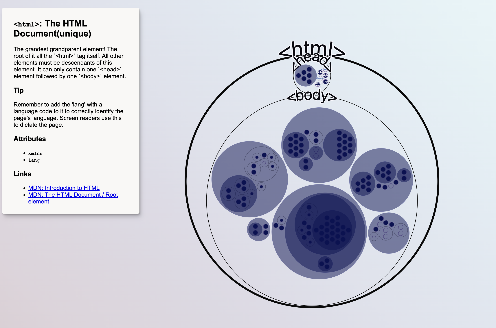

# HTML Elements Visualized

This is an interactive circle pack visualization of most HTML elements and their attributes, view it [here](https://julesblom.com/html-vis/index.html). It’s meant to be explored in the hope that you learn about a couple of new HTML elements, attributes or attribute values.
Read more 

The divisions are mine, the way I think it makes sense and not according to the HTML spec.

## Credits

* [MDN](https://developer.mozilla.org/)
* The idea is based on [Zoomable Circle Packing](https://observablehq.com/@d3/zoomable-circle-packing) by Mike Bostock.
